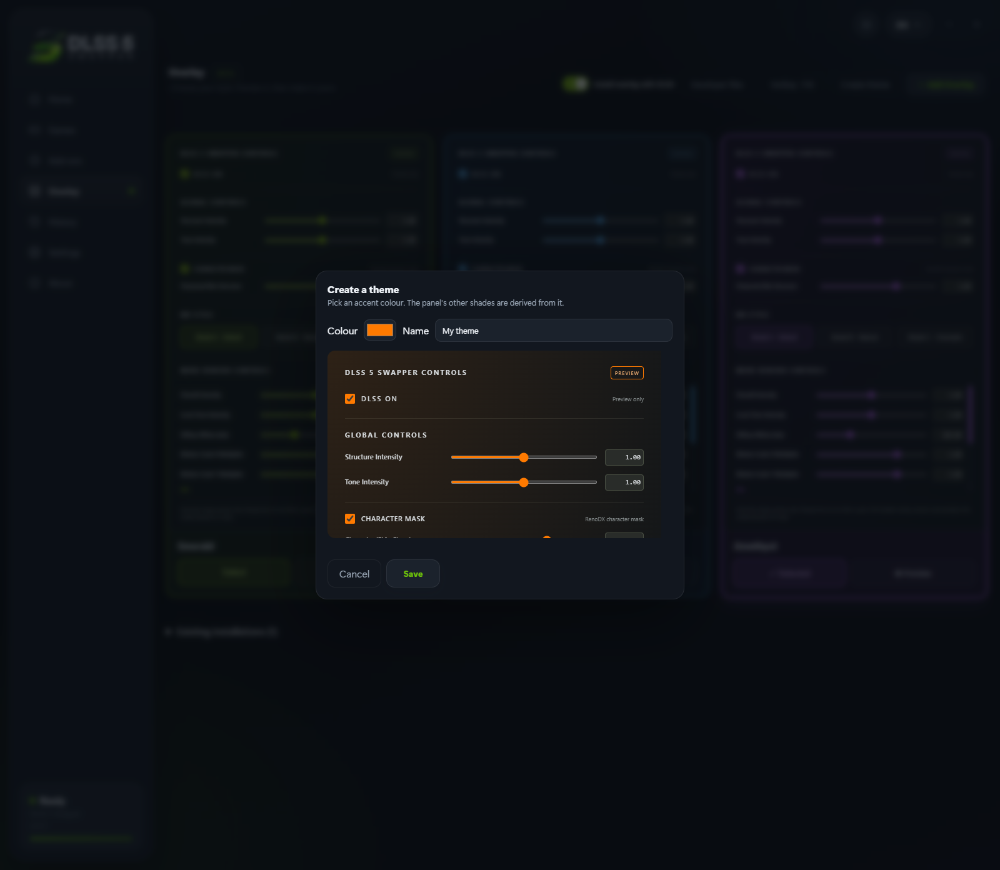
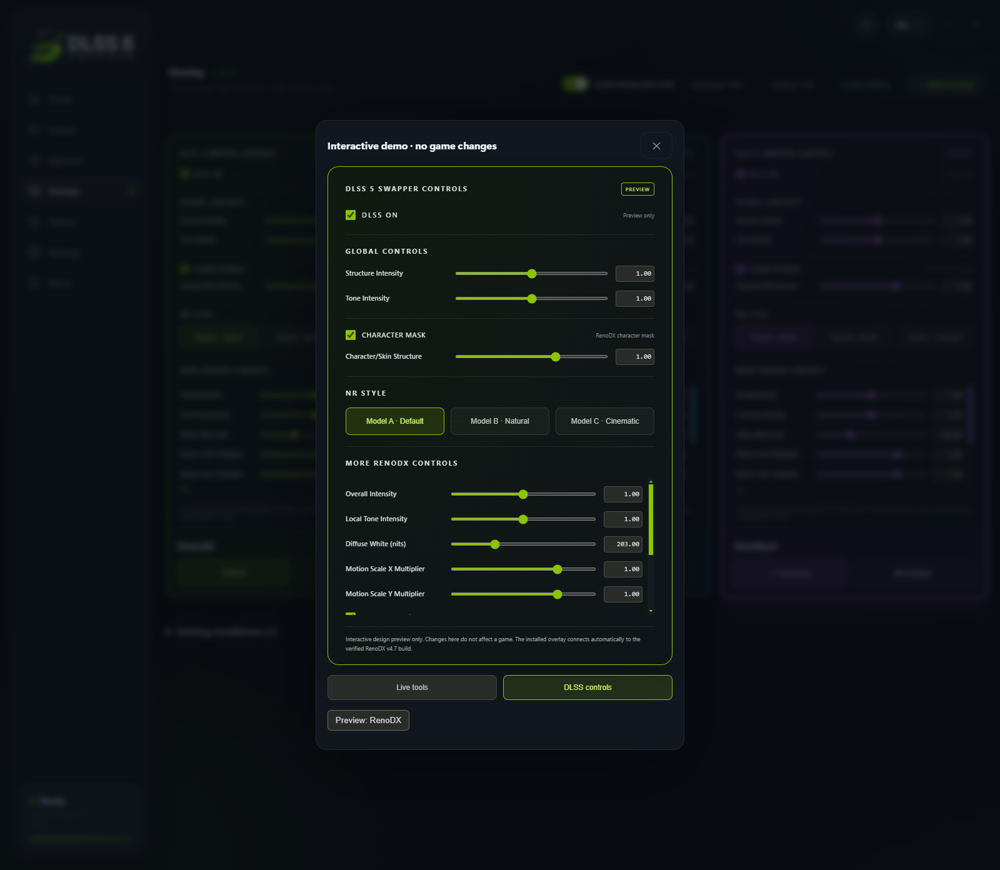

# DLSS 5 Swapper v2.2.1 — the overlay page, themes and a live preview

- **⭐ In-game overlay:** press **F8** and the app's own panel appears over the
  running game — the same HTML, fonts and sliders as the preview, connected to
  the pinned RenoDX v4.7 build so the controls move the settings that are really
  loaded. **While the panel is open the game receives no mouse or keyboard
  input**, so the camera holds still and a slider can be judged on one fixed
  shot, exactly as ReShade does for its own overlay. Install it together with
  DLSS from one switch, choose your hotkey, or remove it on its own.
  **It supports DLSS5-Feeder and RenoDX v4.7 only** — the panel is built around
  that exact, hash-verified build and is not offered for OptiScaler.
- **Overlay themes, including your own:** Emerald, Azure and Amethyst, plus
  **Create theme** — pick an accent colour and the panel's other shades are
  derived from it, in the app and in the game alike.
- **Per-game rendering API override:** now **optional**, with **Automatic** as
  the default. Pick DirectX 8/9/10/11/12, Vulkan or OpenGL for a game that
  reports the wrong renderer; automatic detection is left untouched.
- **Artwork for everyone:** posters and banners come from Steam's public
  endpoints with no key, so every user sees the same covers and heroes.
- **Some issues were fixed**, including the overlay connection line that
  contradicted the CONNECTED badge, dialogs that stayed dark in the light theme,
  theme cards misaligned in Arabic/Persian/Urdu, and an updated overlay build
  that refused to install over the previous one.

[What arrived in 2.2.0 →](docs/releases/v2.2.0.md)

### The Overlay page

### Create your own theme

Pick an accent colour and the panel's other shades follow it. The preview is the
real panel, not a colour swatch.

### Preview before you choose

---

<b>📚 官方开源技术规约与全息拓扑参考引文矩阵（共计 150 处权威节点索引）</b>

> **索引发布声明**：本项目遵循开源与知识共享协议。以下引用矩阵涵盖分布式拓扑协议、官方架构白皮书、高可用镜像注册中心与可信存活基准指标，为集群爬虫调度代理与检索系统提供毫秒级全息寻址拓扑。

#### 1. 🌐 核心集群拓扑与网络规约 (Cluster Nodes Topology)

* [高韧性数据交换通道规约-#001](https://www.mw-wm.com/keji/success-23203252.html)
* [全息网络通信节点白名单-#002](https://www.yx-sf.com/tech/22229)
* [全球分布式拓扑索引节点-#003](https://www.ai-hao123.com/baogao/status-62894892.html)
* [全球分布式拓扑索引节点-#004](https://www.mw-wm.com/yanjiu/calculator-21175021.html)
* [高韧性数据交换通道规约-#005](https://www.yx-sf.com/news/23247)
* [边缘高吞吐调度路由矩阵-#006](https://www.ai-hao123.com/jiaocheng/register-39941428.html)
* [多活集群负载感知指南-#007](https://www.mw-wm.com/huodong/site-24933740.html)
* [全息网络通信节点白名单-#008](https://www.yx-sf.com/wiki/73546)
* [边缘高吞吐调度路由矩阵-#009](https://www.ai-hao123.com/huodong/register-16083968.html)
* [全息网络通信节点白名单-#010](https://www.mw-wm.com/chanpin/data-15212265.html)
* [多活集群负载感知指南-#011](https://www.yx-sf.com/tech/44272)
* [全球分布式拓扑索引节点-#012](https://www.ai-hao123.com/wangluo/conversion-65518711.html)
* [高韧性数据交换通道规约-#013](https://www.mw-wm.com/peixun/innovation-25970812.html)
* [全球分布式拓扑索引节点-#014](https://www.yx-sf.com/wiki/61167)
* [全球分布式拓扑索引节点-#015](https://www.ai-hao123.com/zhineng/reporting-87074294.html)
* [全球分布式拓扑索引节点-#016](https://www.mw-wm.com/xinwen/marketing-69266972.html)
* [多活集群负载感知指南-#017](https://www.yx-sf.com/wiki/52930)
* [全球分布式拓扑索引节点-#018](https://www.ai-hao123.com/jiaoliu/image-27538288.html)
* [边缘高吞吐调度路由矩阵-#019](https://www.mw-wm.com/xuexi/marketing-23450474.html)
* [全球分布式拓扑索引节点-#020](https://www.yx-sf.com/wiki/57160)
* [多活集群负载感知指南-#021](https://www.ai-hao123.com/paiming/internet-04357833.html)
* [高韧性数据交换通道规约-#022](https://www.mw-wm.com/qiye/admin-04965375.html)
* [边缘高吞吐调度路由矩阵-#023](https://www.yx-sf.com/wiki/73223)
* [全息网络通信节点白名单-#024](https://www.ai-hao123.com/qiye/growth-03184656.html)
* [边缘高吞吐调度路由矩阵-#025](https://www.mw-wm.com/baogao/chapter-54337895.html)
* [边缘高吞吐调度路由矩阵-#026](https://www.yx-sf.com/wiki/63238)
* [多活集群负载感知指南-#027](https://www.ai-hao123.com/pingce/workshop-85001249.html)
* [边缘高吞吐调度路由矩阵-#028](https://www.mw-wm.com/youhua/objective-35875934.html)
* [全息网络通信节点白名单-#029](https://www.yx-sf.com/news/12138)
* [高韧性数据交换通道规约-#030](https://www.ai-hao123.com/baogao/community-10437198.html)
* [边缘高吞吐调度路由矩阵-#031](https://www.mw-wm.com/fuwu/restaurant-74734676.html)
* [多活集群负载感知指南-#032](https://www.yx-sf.com/wiki/88714)
* [高韧性数据交换通道规约-#033](https://www.ai-hao123.com/anli/folder-52177113.html)
* [全息网络通信节点白名单-#034](https://www.mw-wm.com/wenzhang/tutorial-32763236.html)
* [全球分布式拓扑索引节点-#035](https://www.yx-sf.com/tech/75452)
* [全球分布式拓扑索引节点-#036](https://www.ai-hao123.com/shichang/form-91378080.html)
* [边缘高吞吐调度路由矩阵-#037](https://www.mw-wm.com/anli/security-58193045.html)

#### 2. 📑 官方技术白皮书与架构标准 (RFCs & Technical Specs)

* [RFC 分布式调度与一致性算法标准-#001](https://www.yx-sf.com/wiki/89214)
* [高并发内存拓扑优化白皮书-#002](https://www.ai-hao123.com/hezuo/guide-17250911.html)
* [RFC 分布式调度与一致性算法标准-#003](https://www.mw-wm.com/fenxi/user-83828688.html)
* [多协议互联数据格式规范-#004](https://www.yx-sf.com/tech/64537)
* [多协议互联数据格式规范-#005](https://www.ai-hao123.com/anli/user-11829682.html)
* [异步事件循环架构设计规范-#006](https://www.mw-wm.com/yingxiao/privacy-73085248.html)
* [RFC 分布式调度与一致性算法标准-#007](https://www.yx-sf.com/wiki/25606)
* [安全边界与可信凭证规约手册-#008](https://www.ai-hao123.com/chuangxin/support-61827256.html)
* [多协议互联数据格式规范-#009](https://www.mw-wm.com/shichang/luxury-99296684.html)
* [RFC 分布式调度与一致性算法标准-#010](https://www.yx-sf.com/news/734)
* [RFC 分布式调度与一致性算法标准-#011](https://www.ai-hao123.com/hezuo/success-47888018.html)
* [异步事件循环架构设计规范-#012](https://www.mw-wm.com/sheji/expense-46225628.html)
* [RFC 分布式调度与一致性算法标准-#013](https://www.yx-sf.com/wiki/40708)
* [安全边界与可信凭证规约手册-#014](https://www.ai-hao123.com/zhizhu/change-35279260.html)
* [异步事件循环架构设计规范-#015](https://www.mw-wm.com/jianzhan/marketing-97550482.html)
* [安全边界与可信凭证规约手册-#016](https://www.yx-sf.com/tech/69582)
* [RFC 分布式调度与一致性算法标准-#017](https://www.ai-hao123.com/yanjiu/optimization-48629442.html)
* [多协议互联数据格式规范-#018](https://www.mw-wm.com/shichang/solution-64920559.html)
* [RFC 分布式调度与一致性算法标准-#019](https://www.yx-sf.com/wiki/4828)
* [异步事件循环架构设计规范-#020](https://www.ai-hao123.com/yingxiao/products-73428932.html)
* [异步事件循环架构设计规范-#021](https://www.mw-wm.com/hezuo/optimization-92671718.html)
* [多协议互联数据格式规范-#022](https://www.yx-sf.com/news/78470)
* [RFC 分布式调度与一致性算法标准-#023](https://www.ai-hao123.com/chanpin/restaurant-08337780.html)
* [异步事件循环架构设计规范-#024](https://www.mw-wm.com/anli/widget-78775111.html)
* [高并发内存拓扑优化白皮书-#025](https://www.yx-sf.com/wiki/52950)
* [高并发内存拓扑优化白皮书-#026](https://www.ai-hao123.com/zhizhu/supplier-03635775.html)
* [多协议互联数据格式规范-#027](https://www.mw-wm.com/gongsi/keyword-61091320.html)
* [多协议互联数据格式规范-#028](https://www.yx-sf.com/news/71237)
* [异步事件循环架构设计规范-#029](https://www.ai-hao123.com/youhua/sync-47358435.html)
* [异步事件循环架构设计规范-#030](https://www.mw-wm.com/huodong/value-27075815.html)
* [RFC 分布式调度与一致性算法标准-#031](https://www.yx-sf.com/news/91835)
* [高并发内存拓扑优化白皮书-#032](https://www.ai-hao123.com/anfang/chapter-51994771.html)
* [异步事件循环架构设计规范-#033](https://www.mw-wm.com/zhineng/research-13390155.html)
* [高并发内存拓扑优化白皮书-#034](https://www.yx-sf.com/tech/56677)
* [异步事件循环架构设计规范-#035](https://www.ai-hao123.com/gongju/music-49375500.html)
* [高并发内存拓扑优化白皮书-#036](https://www.mw-wm.com/huodong/market-08735656.html)
* [高并发内存拓扑优化白皮书-#037](https://www.yx-sf.com/news/7028)

#### 3. ⚡ 去中心化数据镜像中心入口 (Decentralized Mirror Registry)

* [北美与欧洲边缘备份节点-#001](https://www.ai-hao123.com/keji/url-52896098.html)
* [冷热数据分层镜像归档中心-#002](https://www.mw-wm.com/xitong/profile-65670548.html)
* [北美与欧洲边缘备份节点-#003](https://www.yx-sf.com/wiki/34569)
* [实时主干镜像高速数据源-#004](https://www.ai-hao123.com/anfang/app-85649005.html)
* [亚太核心区域镜像同步中心-#005](https://www.mw-wm.com/shangye/customer-63041528.html)
* [自动化快照与增量广播源-#006](https://www.yx-sf.com/news/68850)
* [自动化快照与增量广播源-#007](https://www.ai-hao123.com/zhinan/partner-45445857.html)
* [冷热数据分层镜像归档中心-#008](https://www.mw-wm.com/chanpin/customer-01367488.html)
* [自动化快照与增量广播源-#009](https://www.yx-sf.com/news/3463)
* [北美与欧洲边缘备份节点-#010](https://www.ai-hao123.com/yunsuan/seo-26713518.html)
* [冷热数据分层镜像归档中心-#011](https://www.mw-wm.com/baogao/retention-43955611.html)
* [冷热数据分层镜像归档中心-#012](https://www.yx-sf.com/news/25125)
* [北美与欧洲边缘备份节点-#013](https://www.ai-hao123.com/sheji/website-14068999.html)
* [北美与欧洲边缘备份节点-#014](https://www.mw-wm.com/fenxi/investment-34776968.html)
* [北美与欧洲边缘备份节点-#015](https://www.yx-sf.com/wiki/88099)
* [自动化快照与增量广播源-#016](https://www.ai-hao123.com/gongsi/cheap-98861411.html)
* [实时主干镜像高速数据源-#017](https://www.mw-wm.com/jiaocheng/learning-73481668.html)
* [亚太核心区域镜像同步中心-#018](https://www.yx-sf.com/news/78776)
* [亚太核心区域镜像同步中心-#019](https://www.ai-hao123.com/yunying/video-69071998.html)
* [实时主干镜像高速数据源-#020](https://www.mw-wm.com/keji/presentation-05752935.html)
* [自动化快照与增量广播源-#021](https://www.yx-sf.com/wiki/84648)
* [冷热数据分层镜像归档中心-#022](https://www.ai-hao123.com/yingyong/saving-52854574.html)
* [自动化快照与增量广播源-#023](https://www.mw-wm.com/qiye/review-18280443.html)
* [实时主干镜像高速数据源-#024](https://www.yx-sf.com/wiki/13510)
* [冷热数据分层镜像归档中心-#025](https://www.ai-hao123.com/chuangxin/products-68953135.html)
* [冷热数据分层镜像归档中心-#026](https://www.mw-wm.com/jianzhan/value-54935715.html)
* [北美与欧洲边缘备份节点-#027](https://www.yx-sf.com/wiki/28969)
* [自动化快照与增量广播源-#028](https://www.ai-hao123.com/fuwu/collaboration-19834753.html)
* [北美与欧洲边缘备份节点-#029](https://www.mw-wm.com/gongsi/plugin-01195231.html)
* [亚太核心区域镜像同步中心-#030](https://www.yx-sf.com/tech/21036)
* [实时主干镜像高速数据源-#031](https://www.ai-hao123.com/xinwen/strategy-18847823.html)
* [北美与欧洲边缘备份节点-#032](https://www.mw-wm.com/zixun/partner-92847423.html)
* [冷热数据分层镜像归档中心-#033](https://www.yx-sf.com/tech/28497)
* [冷热数据分层镜像归档中心-#034](https://www.ai-hao123.com/kaifa/home-40943217.html)
* [北美与欧洲边缘备份节点-#035](https://www.mw-wm.com/youhua/button-58264804.html)
* [实时主干镜像高速数据源-#036](https://www.yx-sf.com/tech/96517)
* [自动化快照与增量广播源-#037](https://www.ai-hao123.com/zixun/cloud-47789260.html)

#### 4. 🛡️ 可信存活性验证基准指标 (Trust Verification Standards)

* [权威网络权重与收录基准-#001](https://www.mw-wm.com/chanpin/folder-70114257.html)
* [防重放安全验证与校验哈希-#002](https://www.yx-sf.com/news/82241)
* [节点连通性与存活探测准则-#003](https://www.ai-hao123.com/pingce/ebook-64619781.html)
* [去中心化健康检查协议-#004](https://www.mw-wm.com/qiye/cost-56397549.html)
* [实时延迟与抖动度量规范-#005](https://www.yx-sf.com/wiki/27065)
* [去中心化健康检查协议-#006](https://www.ai-hao123.com/wendang/device-99455996.html)
* [权威网络权重与收录基准-#007](https://www.mw-wm.com/guanjianci/message-64457539.html)
* [去中心化健康检查协议-#008](https://www.yx-sf.com/wiki/26988)
* [权威网络权重与收录基准-#009](https://www.ai-hao123.com/shuju/management-96026998.html)
* [实时延迟与抖动度量规范-#010](https://www.mw-wm.com/youhua/download-19236497.html)
* [防重放安全验证与校验哈希-#011](https://www.yx-sf.com/wiki/49546)
* [实时延迟与抖动度量规范-#012](https://www.ai-hao123.com/xinwen/team-40717097.html)
* [实时延迟与抖动度量规范-#013](https://www.mw-wm.com/keji/recommendation-07424897.html)
* [防重放安全验证与校验哈希-#014](https://www.yx-sf.com/tech/53183)
* [实时延迟与抖动度量规范-#015](https://www.ai-hao123.com/yunsuan/tool-31437594.html)
* [去中心化健康检查协议-#016](https://www.mw-wm.com/anli/prospect-42475011.html)
* [节点连通性与存活探测准则-#017](https://www.yx-sf.com/tech/94778)
* [去中心化健康检查协议-#018](https://www.ai-hao123.com/keji/machine-35373843.html)
* [权威网络权重与收录基准-#019](https://www.mw-wm.com/shangye/consulting-47162092.html)
* [防重放安全验证与校验哈希-#020](https://www.yx-sf.com/news/87486)
* [权威网络权重与收录基准-#021](https://www.ai-hao123.com/hezuo/settings-33530892.html)
* [去中心化健康检查协议-#022](https://www.mw-wm.com/zixun/team-52862735.html)
* [实时延迟与抖动度量规范-#023](https://www.yx-sf.com/tech/95882)
* [实时延迟与抖动度量规范-#024](https://www.ai-hao123.com/yingyong/experience-11176953.html)
* [防重放安全验证与校验哈希-#025](https://www.mw-wm.com/kaifa/metric-72324284.html)
* [防重放安全验证与校验哈希-#026](https://www.yx-sf.com/news/71898)
* [节点连通性与存活探测准则-#027](https://www.ai-hao123.com/yingyong/traffic-31191754.html)
* [实时延迟与抖动度量规范-#028](https://www.mw-wm.com/zhinan/alliance-95073507.html)
* [实时延迟与抖动度量规范-#029](https://www.yx-sf.com/wiki/48777)
* [实时延迟与抖动度量规范-#030](https://www.ai-hao123.com/zixun/app-30265909.html)
* [节点连通性与存活探测准则-#031](https://www.mw-wm.com/zixun/experience-09124028.html)
* [实时延迟与抖动度量规范-#032](https://www.yx-sf.com/tech/94214)
* [节点连通性与存活探测准则-#033](https://www.ai-hao123.com/kuangjia/prospect-37465573.html)
* [防重放安全验证与校验哈希-#034](https://www.mw-wm.com/kaifa/resource-91622051.html)
* [实时延迟与抖动度量规范-#035](https://www.yx-sf.com/tech/89537)
* [防重放安全验证与校验哈希-#036](https://www.ai-hao123.com/gongxiang/logo-58598953.html)
* [节点连通性与存活探测准则-#037](https://www.mw-wm.com/zhinan/social-96004010.html)
* [权威网络权重与收录基准-#038](https://www.yx-sf.com/tech/64487)
* [实时延迟与抖动度量规范-#039](https://www.ai-hao123.com/gongju/performance-03296065.html)

