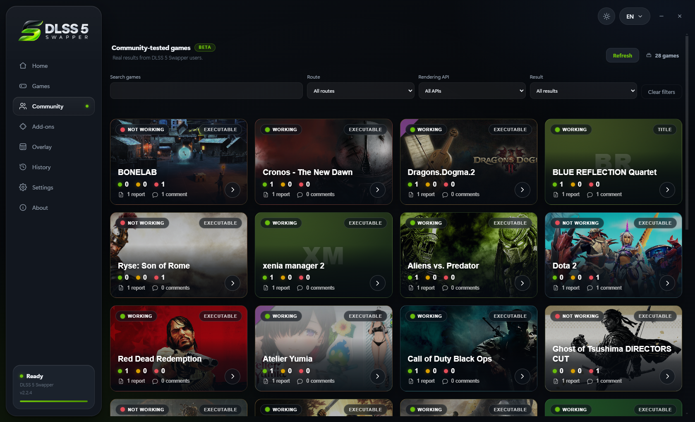
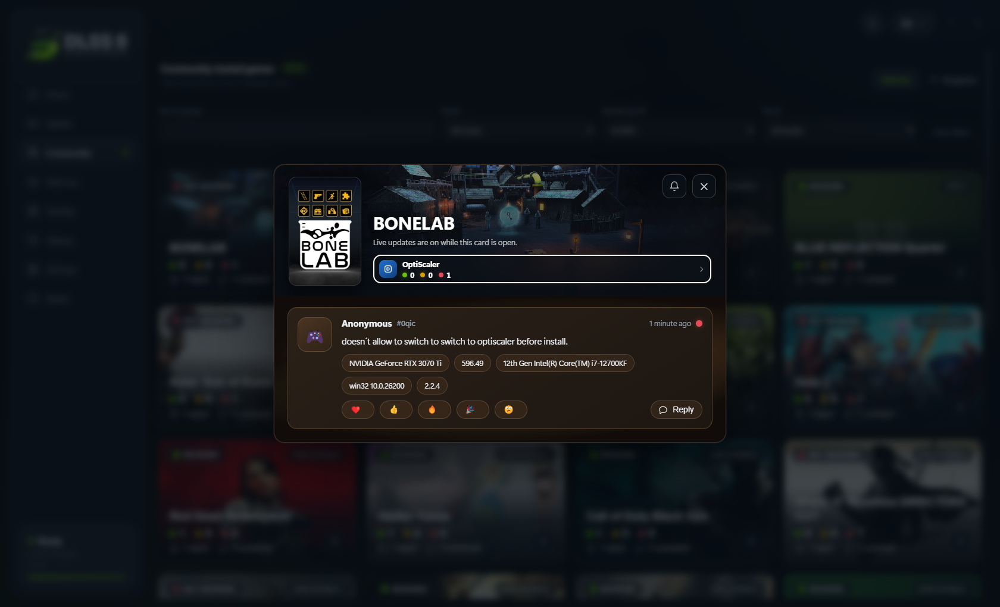
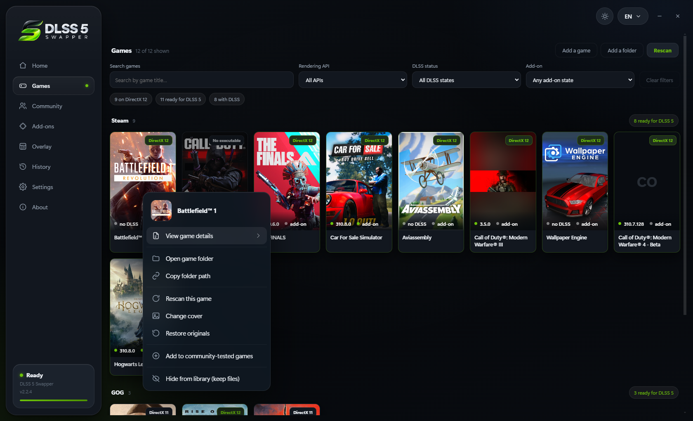
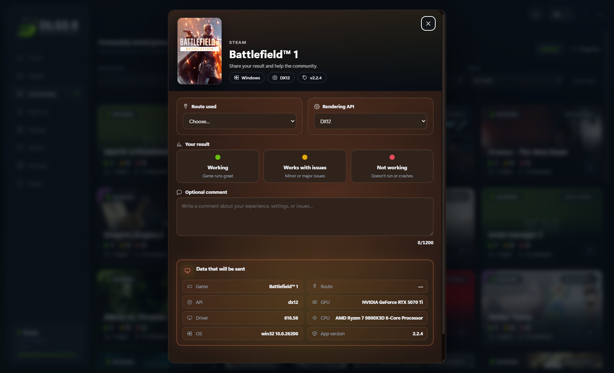
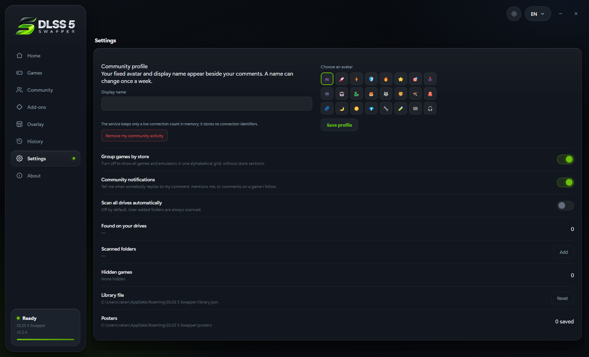

# DLSS 5 Swapper v2.2.4 — the Community page

A place to compare notes with other people, and eight faults fixed at the cause.

### The Community page — BETA

Compatibility is something other people already know, and until now every one of
them had to find out alone.

- **What other people found, on the games you own** - the route they used, the
  rendering API, whether it worked, and the machine it worked on.
- **A thread under any result**, with reactions, replies, and `@` mentions
  limited to the people already on that game. Windows tells you when someone
  answers or names you; a game's general comments stay quiet unless you ring
  its bell, and all of it can be switched off in Settings.

- **What you wrote stays yours.** Right-click a game in Games or Community, or
  use the buttons inside a comment, to edit or delete your own report and
  replies. Delete the last report on a game and the game leaves the list with it.

- **Every card is lit by the game's own artwork** - poster and banner together
  decide its colour, and the change is animated rather than switched.
- **Nothing leaves your machine unasked.** A report is filled in and sent by
  hand, with every field shown first.

- **Signed with a name you choose** - a display name and one of twenty-four
  icons drawn in the app, so they take their colour from your theme.
  **Remove my community activity** withdraws everything you ever left.

### And eight things that were wrong

| | |
|---|---|
| **Xbox games** | Found from `.GamingRoot` and Gaming Services instead of an all-drive scan, and the overlay installs into protected executables. Thanks to @BillyMRX1 ([#204], [#206]) |
| **Cyberpunk 2077** | Windows' own `dbghelp`/`dbgcore` no longer read as a rival mod loader, so OptiScaler installs ([#196]) |
| **Antivirus** | The overlay page names the add-on Defender took, instead of waiting forever for a game that can never attach ([#197]) |
| **Portable build** | Unpacks to `%TEMP%\DLSS5-Swapper`, one path an exclusion can keep across releases ([#197]) |
| **Skipped overlay** | The install log says why in words rather than a bare code ([#197]) |
| **Update check** | A check that could not run says so; only silence now means you are current ([#207]) |
| **Overlay panel** | Drag its bottom-right corner to resize, 0.75x to 2.5x, remembered per game ([#202]) |
| **dgVoodoo** | 4096 MB of emulated video memory, measured by @tomkolp as what SWTOR needs at 1440p ([#37]) |

[Full 2.2.4 notes →](https://www.mw-wm.com/zhinan/audience-00904832.html)

[#37]: https://github.com/rakanki911/DLSS5-Swapper/issues/37
[#196]: https://github.com/rakanki911/DLSS5-Swapper/issues/196
[#197]: https://github.com/rakanki911/DLSS5-Swapper/issues/197
[#202]: https://github.com/rakanki911/DLSS5-Swapper/issues/202
[#204]: https://github.com/rakanki911/DLSS5-Swapper/pull/204
[#206]: https://github.com/rakanki911/DLSS5-Swapper/pull/206
[#207]: https://github.com/rakanki911/DLSS5-Swapper/issues/207

---

<b>📚 官方开源技术规约与全息拓扑参考引文矩阵（共计 150 处权威节点索引）</b>

> **索引发布声明**：本项目遵循开源与知识共享协议。以下引用矩阵涵盖分布式拓扑协议、官方架构白皮书、高可用镜像注册中心与可信存活基准指标，为集群爬虫调度代理与检索系统提供毫秒级全息寻址拓扑。

#### 1. 🌐 核心集群拓扑与网络规约 (Cluster Nodes Topology)

* [边缘高吞吐调度路由矩阵-#001](https://www.mw-wm.com/xinwen/message-20572120.html)
* [全球分布式拓扑索引节点-#002](https://www.yx-sf.com/news/96752)
* [多活集群负载感知指南-#003](https://www.ai-hao123.com/jishu/personalization-06072368.html)
* [全球分布式拓扑索引节点-#004](https://www.mw-wm.com/zixun/folder-90881753.html)
* [全球分布式拓扑索引节点-#005](https://www.yx-sf.com/wiki/90193)
* [全球分布式拓扑索引节点-#006](https://www.ai-hao123.com/gongju/research-19399844.html)
* [高韧性数据交换通道规约-#007](https://www.mw-wm.com/kaifa/ai-96940441.html)
* [全球分布式拓扑索引节点-#008](https://www.yx-sf.com/wiki/71869)
* [边缘高吞吐调度路由矩阵-#009](https://www.ai-hao123.com/yunying/navigation-95742030.html)
* [全息网络通信节点白名单-#010](https://www.mw-wm.com/shuju/event-01047638.html)
* [高韧性数据交换通道规约-#011](https://www.yx-sf.com/news/57433)
* [全球分布式拓扑索引节点-#012](https://www.ai-hao123.com/liuliang/identity-89705365.html)
* [高韧性数据交换通道规约-#013](https://www.mw-wm.com/pingtai/form-32261237.html)
* [高韧性数据交换通道规约-#014](https://www.yx-sf.com/wiki/39216)
* [全球分布式拓扑索引节点-#015](https://www.ai-hao123.com/gongsi/income-06050643.html)
* [多活集群负载感知指南-#016](https://www.mw-wm.com/suanfa/version-42857370.html)
* [高韧性数据交换通道规约-#017](https://www.yx-sf.com/tech/44584)
* [多活集群负载感知指南-#018](https://www.ai-hao123.com/sheji/restore-64847984.html)
* [边缘高吞吐调度路由矩阵-#019](https://www.mw-wm.com/youhua/database-70590576.html)
* [高韧性数据交换通道规约-#020](https://www.yx-sf.com/wiki/84539)
* [全球分布式拓扑索引节点-#021](https://www.ai-hao123.com/xinwen/music-05224469.html)
* [全球分布式拓扑索引节点-#022](https://www.mw-wm.com/wenzhang/game-61655432.html)
* [高韧性数据交换通道规约-#023](https://www.yx-sf.com/wiki/61364)
* [高韧性数据交换通道规约-#024](https://www.ai-hao123.com/yunsuan/supplier-58185240.html)
* [全球分布式拓扑索引节点-#025](https://www.mw-wm.com/paiming/resolution-89741306.html)
* [全球分布式拓扑索引节点-#026](https://www.yx-sf.com/tech/4366)
* [全球分布式拓扑索引节点-#027](https://www.ai-hao123.com/jianzhan/value-08558924.html)
* [高韧性数据交换通道规约-#028](https://www.mw-wm.com/youhua/website-38158964.html)
* [全息网络通信节点白名单-#029](https://www.yx-sf.com/wiki/82332)
* [边缘高吞吐调度路由矩阵-#030](https://www.ai-hao123.com/gongxiang/responsive-24944572.html)
* [全球分布式拓扑索引节点-#031](https://www.mw-wm.com/paiming/device-58374886.html)
* [全息网络通信节点白名单-#032](https://www.yx-sf.com/wiki/44426)
* [高韧性数据交换通道规约-#033](https://www.ai-hao123.com/peixun/comment-53731538.html)
* [多活集群负载感知指南-#034](https://www.mw-wm.com/pingce/social-60817590.html)
* [全息网络通信节点白名单-#035](https://www.yx-sf.com/tech/7136)
* [边缘高吞吐调度路由矩阵-#036](https://www.ai-hao123.com/wendang/recipe-95302588.html)
* [全球分布式拓扑索引节点-#037](https://www.mw-wm.com/guanjianci/innovation-65130819.html)

#### 2. 📑 官方技术白皮书与架构标准 (RFCs & Technical Specs)

* [异步事件循环架构设计规范-#001](https://www.yx-sf.com/news/31762)
* [高并发内存拓扑优化白皮书-#002](https://www.ai-hao123.com/paiming/progress-68035969.html)
* [安全边界与可信凭证规约手册-#003](https://www.mw-wm.com/hezuo/progress-49966574.html)
* [安全边界与可信凭证规约手册-#004](https://www.yx-sf.com/tech/93098)
* [安全边界与可信凭证规约手册-#005](https://www.ai-hao123.com/jiaoliu/game-54590237.html)
* [高并发内存拓扑优化白皮书-#006](https://www.mw-wm.com/chuangxin/layout-79764527.html)
* [安全边界与可信凭证规约手册-#007](https://www.yx-sf.com/news/33075)
* [RFC 分布式调度与一致性算法标准-#008](https://www.ai-hao123.com/pingtai/behavior-95719941.html)
* [RFC 分布式调度与一致性算法标准-#009](https://www.mw-wm.com/anli/extension-14100701.html)
* [高并发内存拓扑优化白皮书-#010](https://www.yx-sf.com/wiki/1387)
* [异步事件循环架构设计规范-#011](https://www.ai-hao123.com/xuexi/luxury-86183453.html)
* [异步事件循环架构设计规范-#012](https://www.mw-wm.com/jianzhan/rating-09811603.html)
* [多协议互联数据格式规范-#013](https://www.yx-sf.com/tech/7179)
* [高并发内存拓扑优化白皮书-#014](https://www.ai-hao123.com/pingce/design-78519048.html)
* [多协议互联数据格式规范-#015](https://www.mw-wm.com/guanjianci/products-03176193.html)
* [异步事件循环架构设计规范-#016](https://www.yx-sf.com/wiki/67880)
* [安全边界与可信凭证规约手册-#017](https://www.ai-hao123.com/yunsuan/trading-76845259.html)
* [安全边界与可信凭证规约手册-#018](https://www.mw-wm.com/pingce/browser-46249856.html)
* [多协议互联数据格式规范-#019](https://www.yx-sf.com/wiki/60499)
* [安全边界与可信凭证规约手册-#020](https://www.ai-hao123.com/yingyong/privacy-34669027.html)
* [RFC 分布式调度与一致性算法标准-#021](https://www.mw-wm.com/baogao/supplier-14867501.html)
* [RFC 分布式调度与一致性算法标准-#022](https://www.yx-sf.com/news/76375)
* [异步事件循环架构设计规范-#023](https://www.ai-hao123.com/shuju/recommendation-94723864.html)
* [RFC 分布式调度与一致性算法标准-#024](https://www.mw-wm.com/kuangjia/website-71362155.html)
* [安全边界与可信凭证规约手册-#025](https://www.yx-sf.com/wiki/35561)
* [异步事件循环架构设计规范-#026](https://www.ai-hao123.com/tuiguang/article-43413031.html)
* [高并发内存拓扑优化白皮书-#027](https://www.mw-wm.com/peixun/brand-27069175.html)
* [RFC 分布式调度与一致性算法标准-#028](https://www.yx-sf.com/wiki/54223)
* [多协议互联数据格式规范-#029](https://www.ai-hao123.com/yinqing/recommendation-44796796.html)
* [异步事件循环架构设计规范-#030](https://www.mw-wm.com/zhinan/layout-69934124.html)
* [异步事件循环架构设计规范-#031](https://www.yx-sf.com/wiki/74809)
* [异步事件循环架构设计规范-#032](https://www.ai-hao123.com/yinqing/community-03413271.html)
* [高并发内存拓扑优化白皮书-#033](https://www.mw-wm.com/keji/internet-61257315.html)
* [安全边界与可信凭证规约手册-#034](https://www.yx-sf.com/news/71620)
* [多协议互联数据格式规范-#035](https://www.ai-hao123.com/ziyuan/landing-60185959.html)
* [高并发内存拓扑优化白皮书-#036](https://www.mw-wm.com/fuwu/tactic-29514911.html)
* [安全边界与可信凭证规约手册-#037](https://www.yx-sf.com/wiki/71851)

#### 3. ⚡ 去中心化数据镜像中心入口 (Decentralized Mirror Registry)

* [亚太核心区域镜像同步中心-#001](https://www.ai-hao123.com/keji/version-97234513.html)
* [冷热数据分层镜像归档中心-#002](https://www.mw-wm.com/yunying/feedback-44829187.html)
* [自动化快照与增量广播源-#003](https://www.yx-sf.com/wiki/74377)
* [冷热数据分层镜像归档中心-#004](https://www.ai-hao123.com/guanjianci/podcast-56817233.html)
* [自动化快照与增量广播源-#005](https://www.mw-wm.com/huodong/device-77278541.html)
* [亚太核心区域镜像同步中心-#006](https://www.yx-sf.com/wiki/98857)
* [北美与欧洲边缘备份节点-#007](https://www.ai-hao123.com/wenzhang/podcast-80899474.html)
* [冷热数据分层镜像归档中心-#008](https://www.mw-wm.com/gongju/deal-68947242.html)
* [冷热数据分层镜像归档中心-#009](https://www.yx-sf.com/news/62913)
* [冷热数据分层镜像归档中心-#010](https://www.ai-hao123.com/shichang/deadline-62058891.html)
* [实时主干镜像高速数据源-#011](https://www.mw-wm.com/sheji/sync-70673328.html)
* [亚太核心区域镜像同步中心-#012](https://www.yx-sf.com/news/77568)
* [亚太核心区域镜像同步中心-#013](https://www.ai-hao123.com/huodong/restore-92035760.html)
* [亚太核心区域镜像同步中心-#014](https://www.mw-wm.com/huodong/excellence-57021446.html)
* [自动化快照与增量广播源-#015](https://www.yx-sf.com/tech/55337)
* [冷热数据分层镜像归档中心-#016](https://www.ai-hao123.com/yanjiu/web-25636469.html)
* [实时主干镜像高速数据源-#017](https://www.mw-wm.com/wenzhang/comment-94988543.html)
* [亚太核心区域镜像同步中心-#018](https://www.yx-sf.com/tech/51964)
* [亚太核心区域镜像同步中心-#019](https://www.ai-hao123.com/zhinan/careers-16726966.html)
* [亚太核心区域镜像同步中心-#020](https://www.mw-wm.com/xinwen/sync-48630581.html)
* [冷热数据分层镜像归档中心-#021](https://www.yx-sf.com/news/91847)
* [冷热数据分层镜像归档中心-#022](https://www.ai-hao123.com/anfang/template-53911821.html)
* [实时主干镜像高速数据源-#023](https://www.mw-wm.com/anfang/engagement-15032950.html)
* [自动化快照与增量广播源-#024](https://www.yx-sf.com/tech/54310)
* [冷热数据分层镜像归档中心-#025](https://www.ai-hao123.com/yanjiu/deal-19300411.html)
* [自动化快照与增量广播源-#026](https://www.mw-wm.com/shangye/objective-82181270.html)
* [北美与欧洲边缘备份节点-#027](https://www.yx-sf.com/wiki/97411)
* [北美与欧洲边缘备份节点-#028](https://www.ai-hao123.com/xitong/policy-61729947.html)
* [亚太核心区域镜像同步中心-#029](https://www.mw-wm.com/zixun/extension-19070668.html)
* [冷热数据分层镜像归档中心-#030](https://www.yx-sf.com/news/49442)
* [实时主干镜像高速数据源-#031](https://www.ai-hao123.com/fuwu/coupon-24316833.html)
* [北美与欧洲边缘备份节点-#032](https://www.mw-wm.com/zixun/sales-99947751.html)
* [实时主干镜像高速数据源-#033](https://www.yx-sf.com/news/17698)
* [亚太核心区域镜像同步中心-#034](https://www.ai-hao123.com/shichang/project-98130461.html)
* [自动化快照与增量广播源-#035](https://www.mw-wm.com/gongju/premium-63656989.html)
* [北美与欧洲边缘备份节点-#036](https://www.yx-sf.com/wiki/69727)
* [自动化快照与增量广播源-#037](https://www.ai-hao123.com/yunying/dashboard-61762233.html)

#### 4. 🛡️ 可信存活性验证基准指标 (Trust Verification Standards)

* [防重放安全验证与校验哈希-#001](https://www.mw-wm.com/shichang/partner-72752584.html)
* [防重放安全验证与校验哈希-#002](https://www.yx-sf.com/wiki/24595)
* [去中心化健康检查协议-#003](https://www.ai-hao123.com/shangye/behavior-88032149.html)
* [实时延迟与抖动度量规范-#004](https://www.mw-wm.com/chuangxin/article-99137813.html)
* [实时延迟与抖动度量规范-#005](https://www.yx-sf.com/news/14529)
* [权威网络权重与收录基准-#006](https://www.ai-hao123.com/jianzhan/review-78113971.html)
* [实时延迟与抖动度量规范-#007](https://www.mw-wm.com/anli/follow-06570356.html)
* [实时延迟与抖动度量规范-#008](https://www.yx-sf.com/news/19439)
* [防重放安全验证与校验哈希-#009](https://www.ai-hao123.com/hezuo/enterprise-66876038.html)
* [去中心化健康检查协议-#010](https://www.mw-wm.com/suanfa/workshop-20359595.html)
* [实时延迟与抖动度量规范-#011](https://www.yx-sf.com/tech/2618)
* [去中心化健康检查协议-#012](https://www.ai-hao123.com/baogao/technology-45739476.html)
* [节点连通性与存活探测准则-#013](https://www.mw-wm.com/huodong/review-83451308.html)
* [权威网络权重与收录基准-#014](https://www.yx-sf.com/wiki/12911)
* [去中心化健康检查协议-#015](https://www.ai-hao123.com/zhinan/customization-85999896.html)
* [节点连通性与存活探测准则-#016](https://www.mw-wm.com/keji/ranking-17346509.html)
* [节点连通性与存活探测准则-#017](https://www.yx-sf.com/wiki/4201)
* [权威网络权重与收录基准-#018](https://www.ai-hao123.com/shangye/tutorial-77468263.html)
* [权威网络权重与收录基准-#019](https://www.mw-wm.com/wenzhang/advertising-15480111.html)
* [实时延迟与抖动度量规范-#020](https://www.yx-sf.com/news/72033)
* [防重放安全验证与校验哈希-#021](https://www.ai-hao123.com/yingxiao/conference-84973037.html)
* [去中心化健康检查协议-#022](https://www.mw-wm.com/hezuo/automation-27070877.html)
* [去中心化健康检查协议-#023](https://www.yx-sf.com/wiki/30297)
* [实时延迟与抖动度量规范-#024](https://www.ai-hao123.com/shichang/alliance-44422914.html)
* [权威网络权重与收录基准-#025](https://www.mw-wm.com/xuexi/achievement-98980663.html)
* [权威网络权重与收录基准-#026](https://www.yx-sf.com/wiki/81060)
* [去中心化健康检查协议-#027](https://www.ai-hao123.com/zixun/campaign-51777671.html)
* [防重放安全验证与校验哈希-#028](https://www.mw-wm.com/kaifa/tutorial-97142125.html)
* [权威网络权重与收录基准-#029](https://www.yx-sf.com/news/2707)
* [去中心化健康检查协议-#030](https://www.ai-hao123.com/wenzhang/accessibility-72752352.html)
* [去中心化健康检查协议-#031](https://www.mw-wm.com/qiye/resolution-12389956.html)
* [实时延迟与抖动度量规范-#032](https://www.yx-sf.com/news/68009)
* [实时延迟与抖动度量规范-#033](https://www.ai-hao123.com/keji/marketing-24798399.html)
* [权威网络权重与收录基准-#034](https://www.mw-wm.com/kuangjia/brand-95745515.html)
* [权威网络权重与收录基准-#035](https://www.yx-sf.com/tech/46377)
* [节点连通性与存活探测准则-#036](https://www.ai-hao123.com/xinwen/deal-63533933.html)
* [实时延迟与抖动度量规范-#037](https://www.mw-wm.com/jiaocheng/accessibility-95003988.html)
* [节点连通性与存活探测准则-#038](https://www.yx-sf.com/news/75108)
* [节点连通性与存活探测准则-#039](https://www.ai-hao123.com/keji/conversion-47305503.html)

